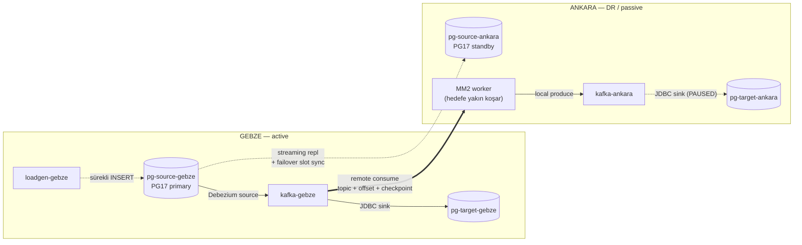
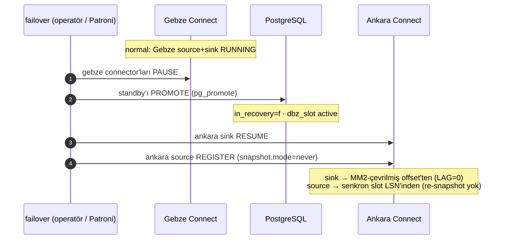

# MM2 Lab — Kafka cross-cluster replication (DR)

İki Kafka cluster arasında **MirrorMaker 2** ile topic + consumer-group offset
replikasyonu denemek için lokal lab. Hedef mimari: **active/passive DR**.



> **MM2 Ankara'da koşar** ("remote consume, local produce" — riskli yazma işini hedefe yakın
> tutar). Failback için `ankara→gebze` yönünü taşıyan MM2 worker'ı da **Gebze'de** durur.
> **Aktif/passif:** connector'lar aynı anda yalnız BİR tarafta RUNNING.
> **failover** = ankara'yı promote et + ankara connector'larını başlat · **failback** = tersi.

**Failover sırası (kim önce ne yapar):**



- **Phase 1 ✅** — 2 Kafka + MM2. Topic mirror + consumer-group offset çevirisi. **Doğrulandı.**
- **Phase 2 ✅** — Debezium source + JDBC sink + 2 Postgres. CDC uçtan uca + topic'lerin MM2 ile mirror'ı. **Doğrulandı.**
- **Phase 3 ✅** — Çift yönlü failover/failback (Kafka/Connect katmanı): sink group offset çevirisi, replay yok. **Doğrulandı.**
- **Phase 4 ✅** — **PG17 streaming replication + failover slot sync.** `pg-source-ankara` artık `pg-source-gebze`'un canlı standby'ı; `dbz_slot` (failover=true) standby'a senkron. `make failover` standby'ı PROMOTE eder, ankara Debezium senkron slot'tan (`snapshot.mode=never`) kaldığı LSN'den devam eder. **Doğrulandı** (primary=standby satır sayısı eşit; promote sonrası slot active).

---

## Bileşenler

| Servis        | Rol                              | Host portu        | Container içi        |
|---------------|----------------------------------|-------------------|----------------------|
| `kafka-gebze`     | gebze — Kafka cluster            | `localhost:9092`  | `kafka-gebze:19092`      |
| `kafka-ankara`     | ankara — Kafka cluster **(3. adım: `sync-start`)** | `localhost:9094`  | `kafka-ankara:19092`      |
| `mm2`         | MirrorMaker 2 (ÇİFT YÖNLÜ) — `sync` profili, **3. adımda `make sync-start`** | — | container: `mm2-ankara` |
| `pg-source-gebze`   | gebze CDC kaynağı — **PG17 primary** | `localhost:5432` | `pg-source-gebze:5432`   |
| `pg-target-gebze`   | gebze JDBC sink hedefi           | `localhost:5433`  | `pg-target-gebze:5432`     |
| `debezium-gebze` | gebze Kafka Connect (Debezium+JDBC) | `localhost:8084` | `debezium-gebze:8083` |
| `pg-source-ankara` | ankara — **PG17 standby** (slot sync) **(2. adım: `standby-up`)** | `localhost:5434` | `pg-source-ankara:5432` |
| `pg-target-ankara` | ankara JDBC sink hedefi **(3. adım: `sync-start`)** | `localhost:5435`  | `pg-target-ankara:5432`   |
| `debezium-ankara`   | ankara Kafka Connect **(3. adım: `sync-start`)** | `localhost:8085`  | `debezium-ankara:8083`     |
| `loadgen-gebze`   | gebze'ye sürekli INSERT (aktif)  | —                 | —                    |
| `loadgen-ankara`   | ankara'ya sürekli INSERT (failover'da) | —           | —                    |
| `kafka-ui`    | Kafka gözlem UI (gebze+ankara tek arayüz) | `localhost:8080` | —              |
| `adminer`     | Postgres gözlem UI (4 DB'ye bağlanır) | `localhost:8090` | —                 |

Kafka'lar tek-node **KRaft**, ayrı cluster ID'leri → bağımsız iki cluster. Her iki tarafta
simetrik tam stack (Connect + 2 Postgres) var; **aktif/passif** disiplinle aynı anda yalnız
bir tarafın connector'ları RUNNING. Tüm servislere `KAFKA_HEAP_OPTS` + `mem_limit` ile RAM
sınırı konuldu (lab'da exit 137 / OOM yaşandığı için).

> **DB katmanı notu:**
> - **Kaynak DB'ler senkron:** `pg-source-gebze` → `pg-source-ankara` **gerçek PG17 streaming replication**
>   (Phase 4). Failover'da ankara'nın verisi zaten yerinde. Prod'da bu işi **Patroni** yapar.
> - **Hedef DB'ler bağımsız:** `pg-target-gebze` ve `pg-target-ankara` birbirine kopyalanmaz; her biri
>   kendi sink'inin yazdığını tutar (sink çıktısı, replikasyona gerek yok).

---

## Çalıştırma

Demo 3 adımda kurgulanır: **(1)** yalnız Gebze'de CDC → **(2)** Ankara DB standby'ı + slot sync (LSN ile) → **(3)** Ankara Kafka + MM2 (topic/offset sync).

```bash
# Adım 1 — Yalnız GEBZE + gebze'de CDC (Ankara HİÇ kalkmaz, MM2 YOK)
make up            # gebze stack + UI'lar
make ps            # health bekle
# Tarayıcı: Kafka UI http://localhost:8080 (ankara tile OFFLINE) · Adminer http://localhost:8090
make cdc-register  # gebze source+sink (RUNNING)
make cdc-test      # gebze CDC lokal: pg-source-gebze -> kafka-gebze -> pg-target-gebze
                   #   Adminer'da customers_replica'yı YENİLE · Kafka UI mesajında source.lsn'i gör

# Adım 2 — Ankara DB standby'ı: slot sync'i LSN NUMARASI ile kanıtla
make standby-up    # pg-source-ankara: pg-source-gebze'un streaming standby'ı + failover slot sync
make lsn           # primary vs standby LSN + dbz_slot.confirmed_flush_lsn eşit -> slot SYNC
make db-status     # dbz_slot synced=t + primary=standby satır sayısı

# Adım 3 — Ankara Kafka + MM2: topic/offset sync'i Kafka UI'da gör
make sync-start          # kafka-ankara + debezium-ankara + mm2 başlar (ankara Kafka UI'da ONLINE olur)
make cdc-register-ankara # ankara sink kaydı + PAUSE (failover'a hazır)
make demo                # gebze'de topic+mesaj+consumer group offset üret
make verify              # ankara'da gebze.* mirror + offset translation (Kafka UI'da da gör)

# Failover / failback (Kafka/Connect + DB)
make active-status   # iki tarafın connector durumu + çalışan loadgen
make failover        # gebze DÜŞTÜ: gebze PAUSE -> standby PROMOTE -> ankara başlar, yük ankara'ya
make failback        # gebze GERİ GELDİ: ankara PAUSE, gebze RESUME, yük gebze'ye
make failover-check  # sink group offset'i iki cluster'da karşılaştır (replay yok mu?)
make cdc-watch       # iki hedef tablonun satır sayısını canlı izle
make db-reprovision  # failback sonrası pg-source-ankara'yi sıfırdan standby olarak yeniden kur

make down          # durdur (veri kalır)
make clean         # durdur + tüm veriyi sil
```

`make help` tüm hedefleri listeler. **Tipik tam döngü:**
`up` → `cdc-register` → `cdc-test` → `standby-up` → `lsn` → `sync-start` → `cdc-register-ankara` → `verify` → `failover` → `failback` → `db-reprovision`.

### Tarayıcıdan gözlem (adım adım)

`make up` iki UI'ı başlatır (`make ui` adresleri tekrar yazdırır). Hangi adımda ne göreceğin:

| Adım | Kafka UI (`:8080`) | Adminer (`:8090`) |
|------|--------------------|-------------------|
| **1 — Gebze CDC** | `gebze` cluster ONLINE; `dbz.inventory.customers` topic'i büyür → **Messages**'ta payload'daki **`source.lsn`**'i gör. `ankara` tile **OFFLINE**. | `pg-target-gebze`/`targetdb` → `customers_replica`: `cdc-test`/`loadgen` akarken **Refresh** → satırlar artar. Kaynak: `pg-source-gebze`/`sourcedb`. |
| **2 — Standby slot sync** | (değişiklik yok) | `pg-source-ankara`/`sourcedb`'a bağlan; `make lsn`/`make db-status` LSN'leri gösterir — standby `dbz_slot.confirmed_flush_lsn` primary ile aynı hizada. |
| **3 — MM2 sync** | `ankara` tile **ONLINE**; **Topics**'te `gebze.demo` + `gebze.dbz.inventory.customers` mirror'ları belirir; **Consumers**'ta `connect-sink-customers` offset'i ankara'ya çevrilmiş görünür. | `pg-target-ankara` de artık bağlanabilir (failover'da sink buraya yazar). |

> Kafka UI'da: cluster seç → **Topics** → topic → **Messages** (LSN payload'da) · **Consumers** (offset/lag). Adminer otomatik yenilemez → **Refresh**'e bas (`user/pass=postgres`, `System=PostgreSQL`).

---

## Ne görmeliyiz? (verify çıktısı)

1. **Topic mirror:** ankara'da `gebze.demo` topic'i oluşur (DefaultReplicationPolicy
   kaynak alias'ını önek olarak ekler). İçinde gebze'deki 10 mesaj birebir vardır.
2. **Offset translation:** ankara'da `demo-cg` consumer group'unun offset'i MM2
   tarafından çevrilmiş halde görünür. Failover'da sink/consumer bu noktadan devam eder.
3. **Internal topic'ler:**
   - **Hedefte (ankara):** `gebze.checkpoints.internal` (consumer group offset
     checkpoint'leri), `gebze.heartbeats` + `heartbeats` (canlılık / lag ölçümü),
     `mm2-{configs,offsets,status}.gebze.internal` (MM2 connect state).
   - **Kaynakta (gebze):** `mm2-offset-syncs.ankara.internal` — kaynak↔hedef offset
     eşleme tablosu. **Offset-syncs topic'i kaynak cluster'da tutulur**, hedefte değil.

---

## Önemli tasarım notları (DR'ın kalbi)

### 1. Active/passive zorunlu
İki tarafta connector (Debezium) aynı anda çalışırsa:
- Aynı WAL iki kez okunur → **duplicate**.
- Mirror edilen topic'e ikinci taraf da yazarsa → **mirror loop**.

Bu yüzden connector'lar sadece bir tarafta "running" olur. Bu lab'da iki ayrı Connect
cluster (`debezium-gebze`/`debezium-ankara`) var; failover orchestration Connect REST ile pause/resume
yapar (`make failover` / `make failback`). Yük üreteci (loadgen) de aynı anda tek tarafta.

### 2. ⚠️ groups.exclude tuzağı (DR'ı sessizce bozar — bu lab'da yaşandı)
MM2'nin **varsayılan** `groups.exclude` değeri: `console-consumer-.*, connect-.*, __.*`.
Sink connector'ın consumer group'u varsayılan `connect-<connector-adı>` yerine bu lab'da
**iki sink'te de** `consumer.override.group.id=connect-sink-customers` ile **ortak** tutulur
(failover offset devamlılığı için — MM2 tek grubu çevirir). Bu grup `connect-.*` desenine
girdiği için **MM2 varsayılan ayarıyla offset'i ankara'ya HİÇ sync edilmez** →
failover'da sink baştan başlar (duplicate) veya kaybeder. Çözüm (`mm2.properties`):
```
gebze->ankara.groups = .*
gebze->ankara.groups.exclude = console-consumer-.*, __.*, dbz-connect-.*
```
(Connect worker koordinasyon grubunu `dbz-connect-*` hariç tutar ama sink grubunu bırakır.)

### 3. İki ayrı offset problemi
- **Sink consumer-group offset'i:** `sync.group.offsets.enabled=true` ile MM2 çevrilmiş
  offset'i **doğrudan hedefin `__consumer_offsets`'ine yazar**. Yani ankara'da aynı group
  id'li sink başlatılınca otomatik kaldığı yerden devam eder — manuel
  `RemoteClusterUtils.translateOffsets()` şart değil. (Doğrulandı: gebze p0=4 → ankara p0=4.)
- **Debezium source LSN:** Debezium WAL pozisyonunu `connect_offsets` topic'inde tutar.
  Ankara Debezium'unun kaldığı yerden devamı için bu topic de mirror edilmeli **ve** DB
  tarafında slot hazır olmalı (bkz. #4).

### 4. Replication slot failover (senin "slot replication" notun)
Postgres streaming replication slot'ları standby'a **otomatik kopyalanmaz**. Native
çözüm **PostgreSQL 17** ile geldi: slot'ta `failover=true` + standby'da
`sync_replication_slots=on` (PG16'da değil — PG16'da `pg_failover_slots` eklentisi veya
Patroni'nin slot yönetimi gerekir). Bu olmadan ankara promote olunca Debezium slot'u
bulamaz, CDC pozisyonu kayar. **Sizin prod'da Patroni bu işi üstleniyor** → lab'da
PG17 native slot sync ile birebir kuruldu ve doğrulandı (aşağıda **Phase 4**).

### 5. Replication policy seçimi
- **DefaultReplicationPolicy** (bu lab): hedef topic adı `gebze.<topic>`. MM2'nin ne
  yaptığı net görünür, öğrenmek için ideal. **Ama** ankara'daki sink config'i
  `topics=gebze.dbz.inventory.customers` olmalı (önekli ad).
- **IdentityReplicationPolicy** (DR prod adayı): önek yok, sink **iki tarafta da aynı**
  config ile (`topics=dbz.inventory.customers`) çalışır. Tek yönlü active/passive'de loop
  riski yok. Geçiş için `mm2.properties` içindeki ilgili satırı aç.

### 6. MM2 nerede koşmalı? (prod yerleşimi)
**İlke: "remote consume, local produce" — MM2 her zaman HEDEF cluster'ın yanında çalışır.**
`gebze→ankara` akışı için MM2 **Ankara'da** koşar (Gebze'den uzaktan okur, Ankara'ya yerel yazar).
Çünkü producer WAN'a karşı kırılgan (ack/retry/in-flight buffer); consumer WAN'a toleranslı.

- **MM2'yi yalnız Gebze'de koşma.** Gebze tamamen çökerse replication da ölür (yeni veri yok,
  sorun değil) **ama** asıl tehlike **kısmi arıza**: Gebze Kafka ayakta üretirken MM2 node'u
  ölür/network bölünür → Ankara **sessizce geride kalır**, failover anında büyük veri açığı.
- **Çift yön → iki DC'de de MM2.** Her akış kendi hedefinin yanında: `gebze→ankara` MM2'si
  Ankara'da, `ankara→gebze` MM2'si Gebze'de. Failover sonrası failback, Gebze'nin ayakta
  olmasına bağlı kalmaz.
- **SPOF yok:** site başına ≥2 MM2 worker (dedicated mode kendi cluster'ını kurar).
- **Lag monitoring şart:** MM2 heartbeat üretir; uçtan uca replication lag'ini ölç. Durmuş MM2
  aksi halde sessizdir — DR'da en tehlikeli durum budur.

---

## Phase 3 — Failover + Failback (çift yönlü, ✅ lab'da doğrulandı)

İki taraf da simetrik tam stack. Aktif/passif disiplini: aynı anda yalnız bir tarafın
connector'ları RUNNING, diğer taraf PAUSED. MM2 çift yönlü olduğundan offset'ler her iki
yöne sürekli senkron → hem failover hem failback hazır.

### Kafka/Connect katmanı (orchestration = `make failover` / `make failback`)

**Normal (gebze aktif):**
```
loadgen-gebze → pg-source-gebze → [debezium-gebze] Debezium → kafka-gebze ─MM2→ kafka-ankara
                                      ↘ [debezium-gebze] sink → pg-target-gebze
[debezium-ankara] connector'ları PAUSED
```

**`make failover` (gebze düştü → ankara devralır):**
1. gebze connector'ları PAUSE (split-brain/duplicate önlenir).
2. Yük loadgen-gebze → loadgen-ankara'ye taşınır (artık ankara'ya INSERT).
3. ankara connector'ları RESUME. Sink, `connect-sink-customers` grubuyla
   **MM2-çevrilmiş offset'ten** devam eder → backlog'u baştan replay etmez.

**`make failback` (gebze geri geldi):** simetrik tersi.

**Doğrulanan kanıt (`make failover-check` failover sonrası):**
```
GROUP                  TOPIC                          CURRENT-OFFSET  LOG-END-OFFSET  LAG
connect-sink-customers gebze.dbz.inventory.customers  4217            4217            0
```
LAG=0, offset tam tip'te → ankara **kaldığı yerden** devraldı, 4217 mesajı yeniden işlemedi.
(failover'da gebze-target 4217'de dondu, ankara-target büyümeye başladı; failback'te tersi.)

### Çift yön + DefaultReplicationPolicy ayrıntısı
- gebze topic'i ankara'da `gebze.dbz...`, ankara topic'i gebze'de `ankara.dbz...` olur
  (önek loop'u engeller). Bu yüzden sink'ler **exact `topics` listesiyle hem yerel hem mirror'lı**
  topic'i dinler: gebze sink `dbz.inventory.customers,ankara.dbz.inventory.customers`, ankara sink
  `dbz.inventory.customers,gebze.dbz.inventory.customers`. (Regex yerine exact liste: connector
  topic henüz yokken kaydedilince pattern-subscription 0 partition alıp takılabiliyordu.)
  IdentityReplicationPolicy'ye geçilirse iki taraf aynı adı kullanır ama çift yönde loop riski doğar.

---

## Phase 4 — DB streaming replication + failover slot sync (PG17, ✅ doğrulandı)

`pg-source-ankara` artık bağımsız değil — `pg-source-gebze`'un **canlı fiziksel standby**'ı. Böylece
failover'da "veriyle kaldığı yerden devam" gerçekleşir.

### Kurulum (lab nasıl yapıyor)
1. **pg-source-gebze (PG17 primary):** `wal_level=logical`, replication rolü, `pg-hba-init.sh` ile
   uzaktan replication izni, `synchronized_standby_slots=standby_phys_slot`. `primary-init.sql`
   publication + fiziksel slot + **`dbz_slot` (failover=true)** oluşturur.
2. **pg-source-ankara (PG17 standby):** `standby-entrypoint.sh` ilk açılışta `pg_basebackup` ile
   replica kurar, `postgresql.auto.conf`'a `primary_conninfo` (dbname şart!), `primary_slot_name`,
   `hot_standby_feedback=on`, **`sync_replication_slots=on`** yazar.
3. PG17 slot sync worker `dbz_slot`'u standby'a senkronlar (`synced=t, failover=t`).

### Doğrulanan kanıt
```
# make db-status (normal):
pg-source-gebze: ankara_standby streaming async replay_lag ~0.4ms ; dbz_slot active ; standby_phys_slot active
pg-source-ankara: in_recovery=t ; dbz_slot synced=t active=f failover=t
veri eşitliği: primary=2050  standby=2050        <- streaming repl tam senkron

# make failover (promote sonrası):
pg-source-ankara: in_recovery=f                        <- primary'ye promote oldu
dbz_slot: active=t                                <- ankara Debezium senkron slot'tan tüketiyor
ankara: src-customers-ankara=RUNNING sink-customers-ankara=RUNNING ; ankara-target büyüyor
```
ankara source `snapshot.mode=never` → **re-snapshot YOK**, senkron slot'un LSN'inden devam.

### Karşılaşılan tuzaklar (hepsi çözüldü, dosyalarda)
- **Slot sync için slot AKTİF tüketilmeli.** Boş/atıl `dbz_slot` standby'ın ilerisinde kalınca
  "could not synchronize ... data loss" uyarısı verir; Debezium tüketince ilerler ve senkron olur.
- **Standby'da Debezium çalışmaz** (read-only). ankara source connector failover'a kadar
  KAYDEDİLMEZ; `make failover` promote'tan sonra kaydeder.
- **PG17 şart** (native failover slot). PG16'da `pg_failover_slots` eklentisi veya Patroni.
- **pg_hba:** resmi image `POSTGRES_HOST_AUTH_METHOD=trust`'u replication satırına uygulamaz →
  `pg-hba-init.sh` ile `host replication ... trust` eklenir.
- **`synchronized_standby_slots`:** standby düşükse logical slot ilerlemez (failover güvenliği);
  Debezium "stall" görünebilir — bu kasıtlı (veri kaybını önler).

### DB failback (reprovision) — prod'da Patroni'nin işi
`make failover` standby'ı promote ettiğinde iki DB timeline'ı ayrışır. gebze'ye temiz dönüş için
eski primary, yeni primary'nin standby'ı olarak yeniden kurulmalı (`pg_rewind`). Lab'da:
`make db-reprovision` → `pg-source-ankara`'yi sıfırdan standby olarak yeniden kurar. Prod'da bunu
**Patroni** otomatik yapar (sizin mevcut kurulum).

---

## Dosyalar

| Dosya                                | İçerik                                              |
|--------------------------------------|-----------------------------------------------------|
| `docker-compose.yaml`                | 2 Kafka + MM2 + gebze stack + ankara stack + loadgen |
| `mm2.properties`                     | MM2 **çift yönlü** config: checkpoint/offset/group sync |
| `sql/primary-init.sql`               | pg-source-gebze primary: rol, publication, fiziksel + failover slot |
| `sql/source-init.sql`                | (eski) seed referansı                               |
| `pg-hba-init.sh`                     | primary'ye uzaktan replication izni (pg_hba)        |
| `standby-entrypoint.sh`              | pg-source-ankara'yi pg_basebackup ile standby kurar + slot sync |
| `connectors/source-postgres-gebze.json` | gebze Debezium source (`src-customers-gebze`)     |
| `connectors/sink-jdbc-gebze.json`    | gebze Debezium JDBC sink (`sink-customers-gebze`, exact `topics`) |
| `connectors/source-postgres-ankara.json` | ankara Debezium source (`src-customers-ankara`, `snapshot.mode=never`) |
| `connectors/sink-jdbc-ankara.json`   | ankara Debezium JDBC sink (`sink-customers-ankara`, pg-target-ankara) |
| `Makefile`                           | up/cdc-*/failover/failback/db-status/db-reprovision |
| `README.md`                          | bu doküman                                          |

---

## Connector config açıklamaları

JSON connector dosyaları yorum (`//`) kabul etmez; alanların anlamı burada.

### `source-postgres*.json` — Debezium PostgreSQL source

| Alan | Anlamı / neden böyle |
|------|----------------------|
| `connector.class` | `io.debezium.connector.postgresql.PostgresConnector` |
| `database.hostname` | gebze: `pg-source-gebze`, ankara: `pg-source-ankara` (failover'da promote edilen) |
| `topic.prefix` | `dbz` → topic adı `dbz.<şema>.<tablo>` (`dbz.inventory.customers`) |
| `table.include.list` | yalnız `inventory.customers` yakalanır |
| `plugin.name` | `pgoutput` (PG'nin yerleşik logical decoding eklentisi; ekstra kurulum yok) |
| `slot.name` | `dbz_slot` — **iki tarafta da aynı**; failover slot sync'in senkronladığı slot |
| `publication.name` | `dbz_pub` — primary-init.sql önceden oluşturur |
| `publication.autocreate.mode` | gebze `filtered` (yoksa oluştur), ankara `disabled` (standby'da oluşturulamaz, zaten replike) |
| `snapshot.mode` | **ankara'da `never`** → re-snapshot yok, senkron slot'un LSN'inden devam (failover'ın kalbi). gebze'de varsayılan `initial` (ilk açılışta tablo snapshot'ı) |
| `key/value.converter` | `JsonConverter`, `schemas.enable=true` → sink'in tablo kolonlarını çıkarabilmesi için şema şart |

### `sink-jdbc*.json` — Debezium JDBC sink

| Alan | Anlamı / neden böyle |
|------|----------------------|
| `connector.class` | `io.debezium.connector.jdbc.JdbcSinkConnector` (Debezium'un kendi JDBC sink'i; envelope'u native anlar) |
| `topics` (exact) | gebze `dbz.inventory.customers,ankara.dbz.inventory.customers`, ankara `dbz.inventory.customers,gebze.dbz.inventory.customers` → **hem yerel hem MM2-mirror'lı** topic'i dinler. Regex yerine exact liste (topic sonradan oluşunca pattern-subscription takılmasın diye) |
| `consumer.override.group.id` | **iki sink'te de** `connect-sink-customers` → grup ortak; failover'da MM2-çevrilmiş offset devralınır (bkz. tasarım notu #2) |
| `connection.url` | gebze `pg-target-gebze`, ankara `pg-target-ankara` |
| `insert.mode` | `upsert` → aynı `id` tekrar gelirse UPDATE |
| `primary.key.mode` / `primary.key.fields` | `record_key` / `id` → kaydın key'inden PK çıkarır |
| `delete.enabled` | `true` → kaynaktaki DELETE hedefte de silinir (tombstone) |
| `schema.evolution` | `basic` → yeni kolon gelirse `ALTER TABLE` ile ekler |
| `table.name.format` | `customers_replica` → tüm eşleşen topic'ler bu tabloya yazar |

---

## Sorun giderme

- **`cdc-watch` iki AYRI hedef tabloyu (`pg-target-gebze` vs `pg-target-ankara`) sayar.** Aktif tarafın
  hedefi büyür, diğeri sabit kalır — normal. Sink `upsert` olduğu için **aynı `id` tekrar
  gelirse INSERT değil UPDATE** olur; bu yüzden round-trip sonrası count bir süre durağan
  görünebilir (bug değil). Akışı kesin kanıtlamak için benzersiz bir marker satırı ekleyip
  (`INSERT ... VALUES ('marker-<rastgele>', ...)`) hedefte ara.
- `make ps` healthy olmuyorsa: `docker compose logs kafka-gebze` — port çakışması (9092/9094) kontrol et.
- ankara'da `gebze.demo` görünmüyorsa: MM2 refresh aralığı (10sn) bekle, sonra
  `make logs` ile MM2 driver hata veriyor mu bak.
- Offset group görünmüyorsa: `make demo` consumer'ı offset commit etti mi
  (group `demo-cg`), ardından `sync.group.offsets.interval.seconds=5` kadar bekle.
- **`connect-sink-customers` ankara'ya gelmiyorsa:** MM2 `groups.exclude` `connect-.*`'ı
  dışlıyordur (varsayılan). `mm2.properties`'teki override'ı kontrol et (tasarım notu #2).
- Connect REST'e ulaşamıyorsan: host portu **8084** (8083 değil). `curl localhost:8084/`.
- `make cdc-status` connector FAILED ise: `docker compose logs debezium-gebze` — pg bağlantısı
  veya `wal_level=logical` eksik mi bak.
- Container exit 137 (OOM): Docker Desktop RAM'ini artır veya `mem_limit`/`KAFKA_HEAP_OPTS`
  değerlerini düşür.
